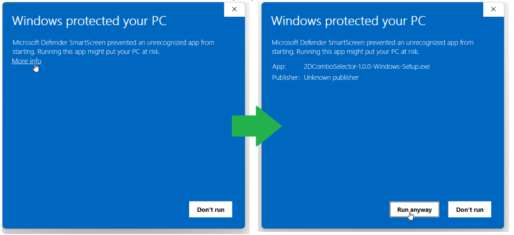

## 2DComboSelector
<p align="center">
  
</p>

2DComboSelector is a graphical application for evaluating, comparing, and ranking combinations of chromatographic conditions for comprehensive two-dimensional separations.

<p align="center">
  
</p>

## Installation

Two installation methods are available:

| Method            | Recommended for                           | Requirements     |
| ----------------- | ----------------------------------------- | ---------------- |
| Windows installer | Most Windows users                        | 64-bit Windows   |
| Python package    | Python users, developers, macOS, or Linux | Python 3.10–3.13 |

For most users on Windows, the all-in-one installer is recommended.

### Option 1 — Windows installer

The Windows installer contains the application and all required dependencies. A separate Python installation is not required.

1. Open the [latest GitHub release](https://github.com/Chapel-Saint-Auret/2DComboSelector/releases/latest).
2. Under **Assets**, download:

   ```text
   2DComboSelector-1.0.0-Windows-Setup.exe
   ```

3. Double-click the downloaded installer.
4. Follow the installation wizard.
5. Optionally select **Create a desktop shortcut**.
6. Launch **2DComboSelector** from the Desktop or Windows Start menu.

The installer currently supports 64-bit Windows systems.

> **Windows security notice**
>
> Because the installer may not yet be digitally signed, Microsoft Defender SmartScreen may display a warning. If the installer was downloaded from the official GitHub repository, select **More info**, verify that the application name is **2DComboSelector**, and then select **Run anyway**.
<p align="center">
  
</p>


#### Updating the Windows application

To install a newer version:

1. Download the newest installer from the [Releases page](https://github.com/Chapel-Saint-Auret/2DComboSelector/releases/latest).
2. Close 2DComboSelector if it is running.
3. Run the new installer.

The installer will update the existing installation. Your input and exported data files are not stored inside the application installation directory and are therefore not removed during the update.

#### Uninstalling the Windows application

Open:

```text
Windows Settings → Apps → Installed apps
```

Find **2DComboSelector**, select it, and choose **Uninstall**.

---

### Option 2 — Installation with Python and pip

This method is intended for users who already work with Python or who want to run 2DComboSelector on macOS or Linux.

#### Requirements

* Python **3.10, 3.11, 3.12, or 3.13**
* pip
* A graphical desktop environment

Download Python from the [official Python website](https://www.python.org/downloads/) if necessary.

On Windows, select **Add Python to PATH** during Python installation.

#### Step 1 — Verify Python

Open PowerShell, Command Prompt, or a terminal and run:

```sh
python --version
```

On Windows, if `python` is not recognized, try:

```powershell
py --version
```

The reported version must be Python 3.10 or newer.

#### Step 2 — Create a virtual environment

Using a virtual environment is recommended because it keeps 2DComboSelector and its dependencies isolated from other Python projects.

On Windows:

```powershell
py -m venv .venv
.venv\Scripts\activate
```

On macOS or Linux:

```sh
python3 -m venv .venv
source .venv/bin/activate
```

When the environment is active, its name normally appears at the beginning of the terminal prompt:

```text
(.venv)
```

#### Step 3 — Upgrade pip

On Windows:

```powershell
python -m pip install --upgrade pip
```

On macOS or Linux:

```sh
python3 -m pip install --upgrade pip
```

#### Step 4 — Install 2DComboSelector

```sh
python -m pip install 2dcomboselector
```

This command installs 2DComboSelector and all required Python dependencies.

#### Step 5 — Launch the application

Run:

```sh
combo-selector
```

If this command is not available, use:

```sh
python -m combo_selector
```

#### Updating the Python package

Activate the same virtual environment, then run:

```sh
python -m pip install --upgrade 2dcomboselector
```

To display the installed version:

```sh
python -c "import combo_selector; print(combo_selector.__version__)"
```

#### Uninstalling the Python package

```sh
python -m pip uninstall 2dcomboselector
```

---

## Troubleshooting

### Python is not recognized

If Windows displays:

```text
'python' is not recognized as an internal or external command
```

try:

```powershell
py --version
```

If `py` is also unavailable, reinstall Python and enable **Add Python to PATH**.

### pip is not recognized

Use pip through Python:

```sh
python -m pip install 2dcomboselector
```

This is more reliable than calling `pip` directly.

### The `combo-selector` command is not recognized

Make sure that the virtual environment used for installation is active.

You can also launch the application with:

```sh
python -m combo_selector
```

### The application does not start

First verify the installed version:

```sh
python -c "import combo_selector; print(combo_selector.__version__)"
```

Then try launching it from the terminal:

```sh
combo-selector
```

Any error displayed in the terminal can be included when reporting the problem.

### Reporting a problem

Before opening a report, please include:

* your operating system;
* your 2DComboSelector version;
* your Python version, if installed with pip;
* the complete error message;
* the steps needed to reproduce the problem.

You can report a problem through the [GitHub issue tracker](https://github.com/Chapel-Saint-Auret/2DComboSelector/issues).

Additional documentation is available on [Read the Docs](https://2dcomboselector-docs.readthedocs.io/).

## Support and feedback

Questions, suggestions, and feature requests are welcome:

* [GitHub Issues](https://github.com/Chapel-Saint-Auret/2DComboSelector/issues)
* [GitHub Discussions](https://github.com/Chapel-Saint-Auret/2DComboSelector/discussions)

Thank you for using **2DComboSelector**.
